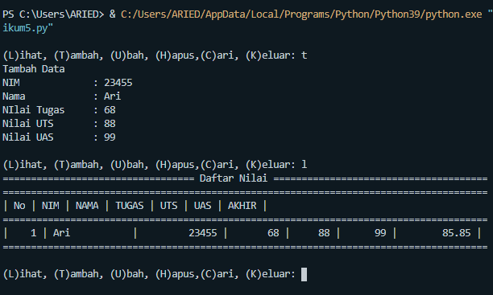

# TUGAS B.PEMOGRAMAN

# NAMA : M. Aqil Al Farid
# Kelas : TI.20.B.1
# NIM : 312010140

# TUGAS PRATIKUM 5

okee, kita lanjut dengan tugas pratikum 5 . kali ini kita akan membuat soal seperti ini :

Dan pada program ini, kita akan menghasilkan program seperti dibawah ini :

jika sudah paham, kita lanjut eksekusi. 

nah pada data diatas, bila kita pilih (L) yang dimaksud ada lihat List maka hasilnya akan kosong dan tidak ada DATA.

Nah pada program ini kita akan membuat List program sesuai yang ada pada gambar diatas, dan diakhiri dengan Break. Apabila kita pilih yang (K).

Pada Codingan ini kita akan membuat Codingan Menambah Data dan Mengubah Data . Menambah Data disimbolkan (D) dan Mengubah Data disimbolkan (U).

Pada gambar diatas ini, kita akan membuat codingan Menghapus Data dan Mencari Data. Menghapus Data disimbolkan (h) dan mencari Data disimbolkan (c).

JIka sudah selesai . Maka tinggal kita jalankan program tersebut. dan masukkan sesuai Soal yang di tugaskan pada Gambar diawal tadi.

Dan hasilnya sesuai yang diperintahkan diatas. Sekian dari saya. 
